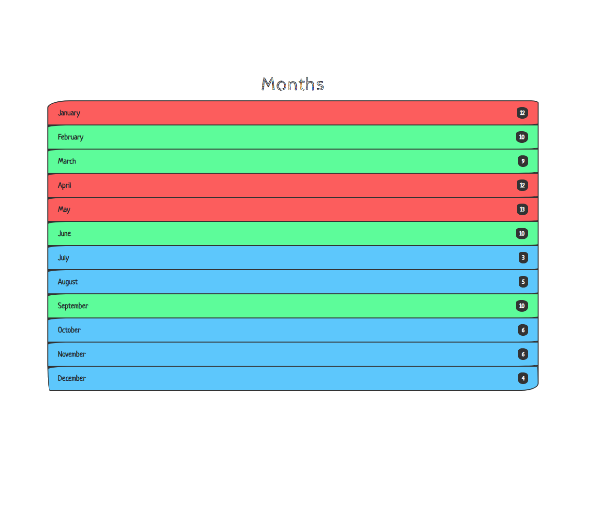
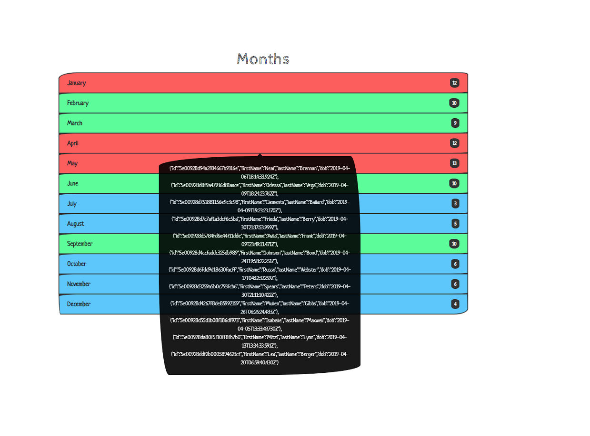

# Тестове завдання для Yalantis React.js School (online)




## Вимоги

```
Технології:
    React.js & Fetch

Вимоги:
    ✅ Завантажити користувачів
    ✅ Відображення списку місяців
    ✅ Підсвітити місяці в залежності від кількості людей, які народилися в цьому місяці.
    ✅ При наведенні на обраний місяць — відобразити список людей, які народилися в цьому місяці.

Умова за кількістю людей, за яким підсвічувати місяці:
[0-2] - сірий
[3-6] - синій
[7-10] - зелений
[11+] - червоний

```

## Запуск проекту на своїй робочій машині

1. npm install
2. npm run start
